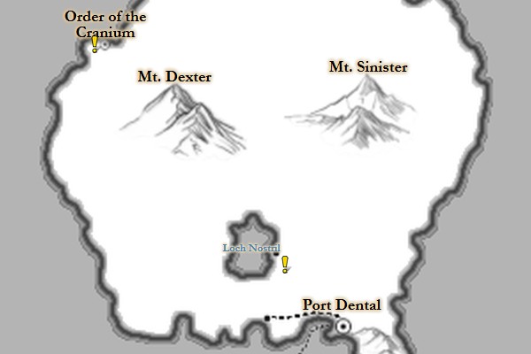

# Fantasy MapTiler

A python tool to create a leaflet style map from multiple image sources.

© 2020 Johannes Novotny and released under the MIT License. See LICENSE.md.

## Example

Click to go to live version 

[](https://jonovotny.github.io/map.html)
 
## Features

* Images can be placed and scaled independently, e.g. to place detail maps into a overall world map
* Automatically generated Leaflet layers, allowing users to toggle the visibility of individual map images
* Customizable zoom options for each layer, e.g. to only show detail maps at zoom levels at which they are legible
* (optional) Preliminary image filter support to create an 'underground' effect using a drop shadow
* (optional) A measuring tool with user-controllable size scale to allow accurate distance measurements
* (optional) Ability to parse marker information from a remote html source, e.g. to create city labels and quest markers

## Requirements

* Python 3 (developed with 3.7.4)
** Additional modules [numpy](https://numpy.org/), [PIL](https://pillow.readthedocs.io/en/stable/), [scipy](https://www.scipy.org/)

## Instructions

To create the example project run the following command on Commandline or PowerShell:

```
python maptiler.py -c example.json
```

Check the Json configuration file ([example.json](https://github.com/jonovotny/fantasy_maptiler/blob/master/example.json)) for customization options.
